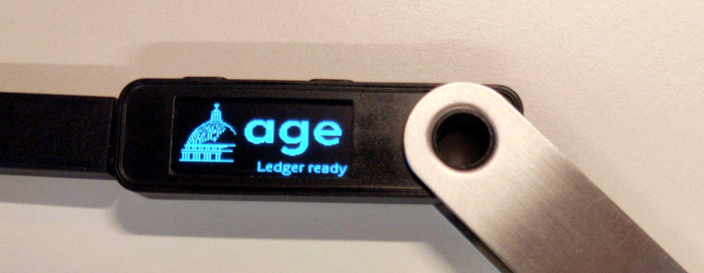

# Ledger plugin for age clients

Encrypt/decrypt files by using [age](https://age-encryption.org/v1) and a public/private key stored on a Ledger device.
This plugin aims to allow interaction between a Ledger device and an age client like [`age`](https://age-encryption.org) or [`rage`](https://str4d.xyz/rage).

This plugin is highly based on [age-plugin-yubikey](https://github.com/str4d/age-plugin-yubikey) by str4d.



## Installation

You can install the plugin using:
```
cargo install age-plugin-ledger
```

You will also need to install [the app for Ledger Nano](https://github.com/Ledger-Donjon/app-age).

## Configuration

`age-plugin-ledger` identities have two parts:
- The secret key material, which is derivated from the Ledger Nano seed and never leaves the device.
- An age identity file, which contains information that an age client can use to figure out which Ledger Nano should be used.

You may run the plugin to print the age identity file associated with the Ledger Nano:

```
$ age-plugin-ledger --identity
```

If you are using passage, you may add this identity to `~/.passage/identities`.

## Usage

The age recipients contained in all connected Ledger Nano can be printed on
standard output:

```
$ age-plugin-ledger --list
```

## License

Licensed under either of

 * Apache License, Version 2.0, ([LICENSE-APACHE](LICENSE-APACHE) or
   http://www.apache.org/licenses/LICENSE-2.0)
 * MIT license ([LICENSE-MIT](LICENSE-MIT) or http://opensource.org/licenses/MIT)

at your option.
